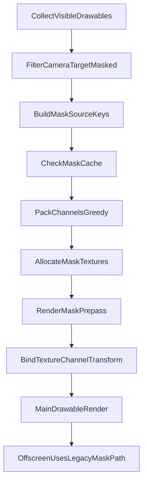

# Cubism URP Optimization Plan

## Goals
- Reduce draw batches and frame time in `CubismRenderPassFeatureOptimized` without regressions in ordering, masking, or offscreen composition.
- Prioritize low-risk changes first, then medium-risk mask/RT optimizations.
- Keep changes isolated to the optimized fork so the original pass remains untouched.
- Prioritize a practical trade-off for this project: optimize camera-target masking first, while deferring offscreen-context mask unification.

## Scope and Primary Files
- Main pass fork: [`D:/Jobs/Joana/Projects/CubismUnityComponents/Packages/com.live2d.cubism/Rendering/URP/CubismRenderPassFeatureOptimized.cs`](D:/Jobs/Joana/Projects/CubismUnityComponents/Packages/com.live2d.cubism/Rendering/URP/CubismRenderPassFeatureOptimized.cs)
- Draw/mask path used by pass: [`D:/Jobs/Joana/Projects/CubismUnityComponents/Packages/com.live2d.cubism/Rendering/CubismRendererUsingBlendMode.cs`](D:/Jobs/Joana/Projects/CubismUnityComponents/Packages/com.live2d.cubism/Rendering/CubismRendererUsingBlendMode.cs)
- Offscreen submit path: [`D:/Jobs/Joana/Projects/CubismUnityComponents/Packages/com.live2d.cubism/Rendering/CubismRenderControllerUsingBlendMode.cs`](D:/Jobs/Joana/Projects/CubismUnityComponents/Packages/com.live2d.cubism/Rendering/CubismRenderControllerUsingBlendMode.cs)
- Interceptor manager (fast-path gating): [`D:/Jobs/Joana/Projects/CubismUnityComponents/Packages/com.live2d.cubism/Rendering/URP/RenderingInterceptor/CubismRenderingInterceptorsManager.cs`](D:/Jobs/Joana/Projects/CubismUnityComponents/Packages/com.live2d.cubism/Rendering/URP/RenderingInterceptor/CubismRenderingInterceptorsManager.cs)

## Pass Architecture Decision (for ROI and maintainability)
- Use a **two-render-pass runtime split** plus a CPU prep stage:
  - **CPU prep stage (no separate ScriptableRenderPass):**
    - visibility filtering
    - dirty/sort decisions
    - mask cache update and channel allocation decisions
  - **MaskPrepass (separate ScriptableRenderPass):**
    - render packed screen-space masks into one or more temporary mask textures
    - execute only when visible camera-target masked drawables exist
  - **MainCubismPass (separate ScriptableRenderPass):**
    - render Cubism drawables using sampled pre-pass masks
    - keep offscreen masking on legacy branch
- Do **not** split CPU-only calculations into extra render passes.
- Do **not** over-split into many tiny passes; excess pass boundaries add setup/barrier overhead.

## Optimization Strategy (Phased)

### Phase 1: Safe, high-ROI pipeline reductions
- **1.1 Controller-level frustum gate**
  - Add a pre-filter in [`D:/Jobs/Joana/Projects/CubismUnityComponents/Packages/com.live2d.cubism/Rendering/URP/CubismRenderPassFeatureOptimized.cs`](D:/Jobs/Joana/Projects/CubismUnityComponents/Packages/com.live2d.cubism/Rendering/URP/CubismRenderPassFeatureOptimized.cs) before sorting.
  - Use controller aggregate bounds from active renderers.
  - Skip sorting and drawing for controllers fully outside camera frustum.
- **1.2 No-interceptor fast path**
  - Add `HasInterceptors` fast check in [`D:/Jobs/Joana/Projects/CubismUnityComponents/Packages/com.live2d.cubism/Rendering/URP/RenderingInterceptor/CubismRenderingInterceptorsManager.cs`](D:/Jobs/Joana/Projects/CubismUnityComponents/Packages/com.live2d.cubism/Rendering/URP/RenderingInterceptor/CubismRenderingInterceptorsManager.cs).
  - In `DrawObjects`, avoid args allocation and event dispatch when no interceptors are registered.
- **1.3 Dirty-gated recomputation**
  - Avoid full skip/sort rebuild unless one of the following changes:
    - render controller group ordering changed
    - drawable render order changed
    - sorting mode/order changed
    - camera moved/rotated beyond threshold (depth-sort mode only)
  - Keep fallback to full recompute behind debug toggle.
- **1.4 Command/state hygiene**
  - Standardize command buffer usage inside `DrawObjects`.
  - Reduce redundant state setting sequences in obvious hot paths.
  - Preserve exact draw order semantics.

### Phase 2: Render-target and mask cost control
- **2.1 Add screen-space mask pre-pass (camera-target only)**
  - Insert pre-pass after visibility checks and before main drawable loop in [`D:/Jobs/Joana/Projects/CubismUnityComponents/Packages/com.live2d.cubism/Rendering/URP/CubismRenderPassFeatureOptimized.cs`](D:/Jobs/Joana/Projects/CubismUnityComponents/Packages/com.live2d.cubism/Rendering/URP/CubismRenderPassFeatureOptimized.cs).
  - Build list of visible masked drawables that render to camera target.
  - Offscreen subtree masking remains legacy and out of this pre-pass scope.
- **2.2 Introduce explicit mask data model**
  - Add internal structs/classes in optimized pass file:
    - `MaskSourceKey` (mask set identity + material variant + transform signature)
    - `MaskScreenRect` (AABB in viewport/screen coordinates)
    - `MaskAllocation` (`textureIndex`, `channelIndex`, atlas rect/transform)
    - `MaskCacheEntry` (last frame hash, allocation, validity)
    - `MaskedRendererBinding` (renderer id to allocation mapping)
- **2.3 Cache invalidation policy**
  - Rebuild mask entries only when one of the following changes:
    - mask source vertex positions / bounds
    - transform affecting screen projection
    - mask source visibility
    - material variant affecting mask write
    - resolution scale or camera projection change
- **2.4 Channel packing algorithm**
  - Use greedy packing per texture:
    - each texture has 4 channels (RGBA)
    - two masks can share channel when AABB does not intersect
  - On overflow, allocate additional temporary mask texture and continue packing.
  - Deterministic order: sort by area descending, then stable id.
- **2.5 Render mask pre-pass**
  - Render each packed mask source once into assigned texture/channel.
  - Clear only textures actually used by current frame allocations.
  - Keep full fallback path to legacy per-draw mask rendering behind toggle.
- **2.6 Bind sampling data to drawables**
  - Extend draw path in [`D:/Jobs/Joana/Projects/CubismUnityComponents/Packages/com.live2d.cubism/Rendering/CubismRendererUsingBlendMode.cs`](D:/Jobs/Joana/Projects/CubismUnityComponents/Packages/com.live2d.cubism/Rendering/CubismRendererUsingBlendMode.cs) to read pre-pass bindings.
  - Pass `(maskTexture, channel, transform)` via property block for camera-target masked drawables.
  - For offscreen-rendered drawables, keep current legacy masking branch unchanged.
- **2.7 Resolution scaling control**
  - Add configurable screen-space mask scale (1.0 default, optional 0.5/0.25).
  - Apply to pre-pass mask texture descriptor only.
  - Expose as serialized field on optimized renderer feature.

### Phase 3: Optional advanced improvements
- **3.1 Safe micro-batching islands**
  - Identify contiguous sequences sharing:
    - same render target
    - same material variant
    - no ordering hazard
  - Reduce redundant state transitions first, then consider grouped emits.
- **3.2 Per-drawable culling (optional)**
  - Add only if controller-level culling does not reach target.
  - Ensure masked dependency chains are preserved.
- **3.3 Diagnostics**
  - Add counters and debug output for:
    - pre-pass mask draw count
    - cache hit/miss ratio
    - allocated mask texture count
    - RT switches and blit count
  - Use these as acceptance gates per phase.

## Detailed Execution Guide

### Step A: Acceptance targets using existing project scenes
- Use the existing 2-3 project validation scenes for iterative checks after each implementation slice.
- Define phase goals:
  - Phase 1: measurable CPU-side render-thread reduction with no visual deltas
  - Phase 2: mask draw count reduction and RT churn reduction
- Record representative before/after numbers as needed during each phase (no separate upfront baseline task required).

### Step B: Phase 1 implementation order
- Implement frustum gate.
- Implement interceptor fast path.
- Implement dirty-gated sort/skip recompute.
- Validate visuals and ordering.
- Capture metrics and compare to baseline.

### Step C: Phase 2 implementation order
- Add mask data model and cache containers in optimized pass.
- Build masked drawable collection after visibility.
- Implement channel packing and overflow textures.
- Render pre-pass masks and bind per-renderer sampling data.
- Integrate sampling path in `CubismRendererUsingBlendMode`.
- Keep legacy mask path as runtime fallback switch.
- Validate in masked and multi-model scenes.
- While implementing, structure code as:
  - `PrepareFrameData()` style CPU prep (inside feature)
  - `MaskPrepass` class for screen-space mask rendering
  - `MainCubismPass` class for final Cubism rendering

### Step D: Rollout controls
- Add feature flags on `CubismRenderPassFeatureOptimized`:
  - `EnableFrustumGate`
  - `EnableInterceptorFastPath`
  - `EnableDirtySortGate`
  - `EnableScreenSpaceMaskPrepass`
  - `EnableLegacyMaskFallback`
  - `MaskResolutionScale`
- Default to safe behavior (legacy-compatible) and enable optimizations progressively.

## Data Flow (Phase 2)

## Risk Register and Mitigations
- **Risk:** channel packing conflicts produce wrong mask sampling.
  - **Mitigation:** deterministic packing + validation mode that visualizes channel assignment.
- **Risk:** cache invalidation bugs cause stale masks.
  - **Mitigation:** strict invalidation rules + one-switch fallback to full redraw.
- **Risk:** offscreen edge-case regressions.
  - **Mitigation:** explicitly keep offscreen on legacy masking in this phase.
- **Risk:** optimization gains offset by pre-pass overhead for tiny scenes.
  - **Mitigation:** bypass pre-pass when masked drawable count below threshold.

## Guardrails and Correctness Criteria
- Preserve rendering order semantics for `CubismSortingMode` and grouped sorting.
- Preserve offscreen parent-child submission behavior and blend mode output.
- Preserve mask visual output under normal settings when optimization toggles are disabled.
- Keep fallback switches to disable each optimization independently for quick bisecting.
- Explicitly scope Phase 2 screen-space masking to camera-target rendering; offscreen-context screen-space masking is deferred unless needed.

## Measurement and Validation Plan
- Use identical test scenes/model/camera between old and optimized pass.
- Measure before/after:
  - FPS and frame time
  - draw batches
  - Frame Debugger counts of `DrawMesh`, `SetRenderTarget`, `Blit`
  - Profiler time in render thread and GPU
- Validate edge cases:
  - masked and unmasked models
  - offscreen-heavy models (must remain visually correct under legacy offscreen mask path)
  - multiple Cubism models with different sorting groups
  - scene/game camera behavior in editor
- Add visual diff checks:
  - masked edge correctness
  - blend ordering correctness
  - animation-driven mask movement correctness
- Add performance checks by scenario:
  - single model, high mask count
  - multi-model overlap
  - no-mask scene (ensure minimal overhead when pre-pass not needed)

## Expected Outcome
- Phase 1 should reduce CPU-side per-frame overhead and some redundant draw-path work.
- Phase 2 should significantly reduce mask-related GPU/render-thread churn for camera-target rendering through pre-pass reuse and channel packing.
- Phase 3 is exploratory and only applied if profiling still shows clear bottlenecks after phases 1-2.
- This plan is implementation-ready and can be used as a step-by-step development guide with rollback points per feature flag.